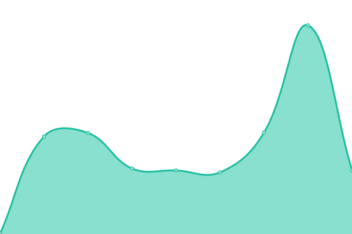
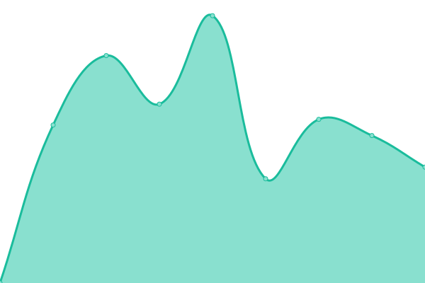

# [📈 Live Status](https://uptime.zio.sh): <!--live status--> **🟧 Partial outage**

This repository contains the open-source uptime monitor and status page for [Zio](https://uptime.zio.sh), powered by [Upptime](https://github.com/upptime/upptime).

With [Upptime](https://upptime.js.org), you can get your own unlimited and free uptime monitor and status page, powered entirely by a GitHub repository. We use [Issues](https://github.com/ziodotsh/upptime/issues) as incident reports, [Actions](https://github.com/ziodotsh/upptime/actions) as uptime monitors, and [Pages](https://uptime.zio.sh) for the status page.

<!--start: status pages-->
<!-- This summary is generated by Upptime (https://github.com/upptime/upptime) -->
<!-- Do not edit this manually, your changes will be overwritten -->
<!-- prettier-ignore -->
| URL | Status | History | Response Time | Uptime |
| --- | ------ | ------- | ------------- | ------ |
|  [Server DE01 (Hetzner)](https://de01.zio.sh) | 🟩 Up | [server-de-01-hetzner.yml](https://github.com/ziodotsh/upptime/commits/HEAD/history/server-de-01-hetzner.yml) | 

 691ms
     
 | 

<a href="https://uptime.zio.sh/history/server-de-01-hetzner">100.00%</a>
    

|  [Server GB01 (Virgin Media)](https://gb01.zio.sh) | 🟥 Down | [server-gb-01-virgin-media.yml](https://github.com/ziodotsh/upptime/commits/HEAD/history/server-gb-01-virgin-media.yml) | 

 487ms
     
 | 

<a href="https://uptime.zio.sh/history/server-gb-01-virgin-media">0.00%</a>
    

|  [Server GB02 (KCOM)](https://gb02.zio.sh/health-check) | 🟩 Up | [server-gb-02-kcom.yml](https://github.com/ziodotsh/upptime/commits/HEAD/history/server-gb-02-kcom.yml) | 

 421ms
     
 | 

<a href="https://uptime.zio.sh/history/server-gb-02-kcom">99.73%</a>
    

|  [Cloud (Nextcloud)](https://cloud.zio.sh) | 🟩 Up | [cloud-nextcloud.yml](https://github.com/ziodotsh/upptime/commits/HEAD/history/cloud-nextcloud.yml) | 

 1185ms
     
 | 

<a href="https://uptime.zio.sh/history/cloud-nextcloud">100.00%</a>
    

|  [Git (Gitea)](https://git.zio.sh) | 🟩 Up | [git-gitea.yml](https://github.com/ziodotsh/upptime/commits/HEAD/history/git-gitea.yml) | 

 675ms
     
 | 

<a href="https://uptime.zio.sh/history/git-gitea">100.00%</a>
    

|  [Mail](https://mail.zio.sh) | 🟩 Up | [mail.yml](https://github.com/ziodotsh/upptime/commits/HEAD/history/mail.yml) | 

 758ms
     
 | 

<a href="https://uptime.zio.sh/history/mail">100.00%</a>
    

|  [OSTree Repo](https://ostree.zio.sh) | 🟩 Up | [os-tree-repo.yml](https://github.com/ziodotsh/upptime/commits/HEAD/history/os-tree-repo.yml) | 

 488ms
     
 | 

<a href="https://uptime.zio.sh/history/os-tree-repo">100.00%</a>
    

|  [ZNC](https://znc.zio.sh) | 🟩 Up | [znc.yml](https://github.com/ziodotsh/upptime/commits/HEAD/history/znc.yml) | 

 496ms
     
 | 

<a href="https://uptime.zio.sh/history/znc">100.00%</a>
    

|  [Hetzner Robot](https://robot.your-server.de) | 🟥 Down | [hetzner-robot.yml](https://github.com/ziodotsh/upptime/commits/HEAD/history/hetzner-robot.yml) | 

 0ms
     
 | 

<a href="https://uptime.zio.sh/history/hetzner-robot">0.00%</a>
    

<!--end: status pages-->

[**Visit our status website →**](https://uptime.zio.sh)

## 📄 License

- Powered by: [Upptime](https://github.com/upptime/upptime)
- Code: [MIT](./LICENSE) © [Zio](https://uptime.zio.sh)
- Data in the `./history` directory: [Open Database License](https://opendatacommons.org/licenses/odbl/1-0/)
